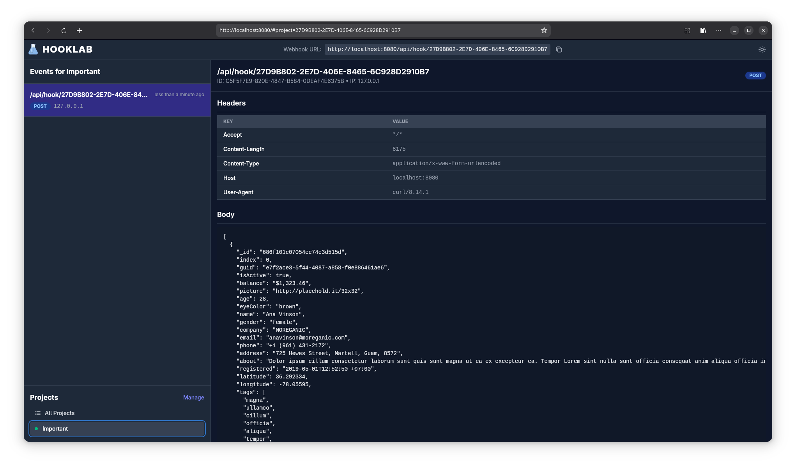

# HookLab - Webhook Inspector

HookLab is a powerful and developer-friendly tool for inspecting and debugging webhooks. It provides a clean and intuitive interface to capture, view, and analyze incoming webhook requests in real-time, making it an essential utility for modern web development.

This project is a full-stack application built with a **Vapor (Swift)** backend and a **Svelte** frontend, fully containerized with **Docker**.



## Features

-   **Real-time Event Inspection:** View incoming webhook requests as they happen.
-   **Project-based Organization:** Group related webhooks into projects for easy management.
-   **Detailed Request/Response Views:** Inspect headers, bodies, and other details of each request.
-   **Dark/Light Mode:** A comfortable viewing experience in any lighting condition.
-   **Containerized:** Run the entire application with a single Docker command.

## Tech Stack

### Backend

-   **Framework:** [Vapor 4](https://vapor.codes/) (Swift)
-   **Database:** [Fluent](https://docs.vapor.codes/4.0/fluent/overview/) with SQLite
-   **Async:** [SwiftNIO](https://github.com/apple/swift-nio)

### Frontend

-   **Framework:** [Svelte 5](https://svelte.dev/)
-   **Build Tool:** [Vite](https://vitejs.dev/)
-   **Styling:** [Tailwind CSS](https://tailwindcss.com/)

## Getting Started

### Prerequisites

-   [Docker](https://www.docker.com/get-started) and [Docker Compose](https://docs.docker.com/compose/install/)
-   [Swift 6.0](https://www.swift.org/download/) (for local backend development)
-   [Node.js](https://nodejs.org/) and [Yarn](https://yarnpkg.com/) (for local frontend development)

### Running with Docker (Recommended)

The easiest way to get started is with Docker.

1.  **Build the Docker images:**
    ```bash
    docker compose build
    ```

2.  **Run the application:**
    ```bash
    docker compose up app
    ```

The application will be available at [http://localhost:8080](http://localhost:8080).

### Local Development

For more advanced development, you can run the frontend and backend services separately.

#### Backend (Vapor)

1.  **Navigate to the project root.**
2.  **Build the Swift project:**
    ```bash
    swift build
    ```
3.  **Run the database migrations:**
    ```bash
    swift run hooklab migrate
    ```
4.  **Start the backend server:**
    ```bash
    swift run hooklab serve
    ```
The backend API will be running on port 8080.

#### Frontend (Svelte)

1.  **Navigate to the project root.**
2.  **Install frontend dependencies:**
    ```bash
    yarn install
    ```
3.  **Start the Vite development server:**
    ```bash
    yarn dev
    ```
    This will watch for changes in the `Frontend/` directory and automatically rebuild the assets in `Public/`.

## Building for Production

The Docker build process handles the production build automatically. To manually build the frontend for production, run:

```bash
yarn build
```

This will create optimized and minified assets in the `Public/assets` directory.

## Project Structure

```
.
├── Docs/                 # Documentation and screenshots
├── Dockerfile            # Defines the production Docker image
├── docker-compose.yml    # Docker Compose configuration
├── Frontend/             # Svelte source code
│   ├── Components/       # Svelte components
│   ├── stores.js         # Svelte stores for state management
│   └── index.js          # Main Svelte entry point
├── Public/               # Compiled frontend assets (served by Vapor)
├── Sources/              # Vapor backend source code
│   └── hooklab/
│       ├── Controllers/  # Vapor route handlers
│       ├── Migrations/   # Database migrations
│       └── Models/       # Fluent models
├── Package.swift         # Swift package definition
├── package.json          # Frontend dependencies and scripts
└── tailwind.config.js    # Tailwind CSS configuration
```